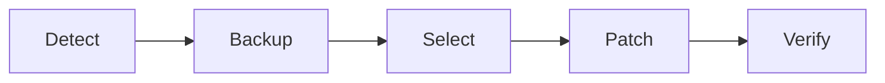

# theme-patcher-configurator 🎨🗂️

  

*Give your archiver a face-lift — reskin WinRAR and 7‑Zip without touching a single byte of the executables you didn't write.*

  

## 🌈 Overview

Let's be honest: the default WinRAR and 7‑Zip windows look like they were frozen in amber sometime around 2007. They work beautifully — nobody's disputing that — but visually they're stuck in a decade of gray gradients and pixel-thin icons. **theme-patcher-configurator** exists to close that gap. It's a focused, standalone configurator that applies curated skins, icon packs, and color schemes to your archiver's UI shell, then lets you tweak the details through a friendly settings panel instead of hand-editing `.rar.theme` or ini-style config files at 1am.

This project was born out of a very specific itch: theming resources for these archivers exist scattered across forums, personal blogs, and abandoned repos, but there was never a single tool that made *applying* and *reverting* them safe, predictable, and reversible. So we built one. Under the hood it's a thin, careful patcher — it never modifies your original installation binaries, it operates on resource and skin layers the applications already expose, and it keeps backups so you can always step back to stock.

Who's this for? Power users who live inside archive managers all day, theming enthusiasts who enjoy a cohesive desktop aesthetic, sysadmins deploying a consistent visual identity across a fleet of machines, and anyone who simply thinks their file compression tool deserves better than default gray. If any of that sounds like you, keep reading — this is your new favorite little utility.

## 🚀 Get It

> [!NOTE]
> The button above always points to our GitHub Pages landing page, which hosts the current stable build along with changelog notes and mirrors. Bookmark it — that's the canonical source.

---

<b>✨ What Makes It Tick — Core Capabilities</b>

 

- **Dual-engine awareness** — the configurator detects whether you have WinRAR, 7‑Zip, or both installed, and adapts its theme catalog and patch paths accordingly, so you're never applying the wrong skin format to the wrong host app.

- **Live preview canvas** — before committing anything, a miniature mock-up of the archiver window updates in real time as you scrub through color palettes, toolbar icon sets, and title-bar accents.

- **One-click revert** — every patch operation snapshots the prior state first. If a theme looks worse in practice than in the preview, one button restores the exact configuration you had before.

- **Community theme catalog** — bundled and browsable inside the app, with tags for dark, light, high-contrast, and "retro-90s" style packs, curated and versioned so stale or broken themes get pruned automatically.

- **Icon set remapping** — swap out toolbar and context-menu icons independently of the color theme, mixing and matching so a dark palette doesn't force you into icons you don't like.

- **Portable profile export** — save your current theme configuration as a small profile file and carry it to another machine, handy for multi-PC setups or fresh reinstalls.

- **Zero telemetry footprint** — the patcher runs entirely offline; no theme data, usage stats, or file paths ever leave your machine.

- **Batch mode for admins** — apply a single theme profile across multiple detected installs or user accounts in one pass, useful for shared or lab machines.

<b>🧭 How to Get Started</b>

 

1. **Visit the landing page** using the download button above — it always serves the newest tagged build.

2. **Download the standalone executable.** There's nothing to extract, no bundled installer wizard with sixteen "Next" screens — just one file.

3. **Run it.** The configurator auto-detects your installed archiver(s) and shows you a live snapshot of their current look.

4. **Pick a theme, preview it, apply it.** Done. Reopen WinRAR or 7‑Zip and enjoy the new coat of paint.

> [!TIP]
> Run the patcher once right after installing a fresh copy of WinRAR or 7‑Zip. Theming a clean install avoids any conflicts with prior manual tweaks you might have forgotten about.

---

## 🖥️ System Requirements

| Requirement | Details |
|---|---|
| OS | Windows 10 (21H2+) or Windows 11 |
| Architecture | x64 (ARM64 via emulation supported) |
| Dependencies | None — fully self-contained, no .NET/VC++ redistributables required |
| Disk space | Under 40 MB, themes cached locally |
| Admin rights | Only required if WinRAR/7‑Zip is installed in a system-protected directory |

> [!IMPORTANT]
> This tool patches *visual resource layers* exposed by the archivers — it does not modify licensing, activation, or core compression logic in any way. It's cosmetic, top to bottom.

---

## ⚙️ How It Works

The architecture is deliberately simple — fewer moving parts means fewer things that can break your setup.

1. **Detection** — the configurator scans common install paths and registry hints to locate WinRAR and/or 7‑Zip.
2. **Backup** — the current theme/skin state is snapshotted to a local restore point before anything changes.
3. **Selection** — you choose a theme, icon set, and accent from the catalog or a custom profile.
4. **Patch** — the tool writes the new resource layer into the application's designated theme/skin directory.
5. **Verify** — a post-patch check confirms the archiver still launches cleanly, flagging anything unexpected.

---

<b>🧩 Troubleshooting — Real Questions, Real Answers</b>

 

**Q: WinRAR still shows the old theme after patching. What gives?**
A: Fully close WinRAR from the system tray/taskbar (not just the window) and relaunch. It caches UI resources in memory during a session.

**Q: 7‑Zip's File Manager didn't update, but the archiver dialog did.**
A: They're separate components with independent skin layers. Toggle the "Apply to File Manager" checkbox in settings before patching.

**Q: I applied a theme and now icons look blurry on my 4K display.**
A: Enable **High-DPI Icon Mode** in settings — it swaps to the vector-based icon variant instead of the legacy bitmap set.

**Q: Can I use this on a portable/USB copy of 7‑Zip?**
A: Yes — point the configurator at the portable folder manually via "Custom Install Path" in the detection screen.

**Q: The revert button says "no backup found."**
A: This happens if you manually edited theme files outside the tool beforehand. Reinstall the archiver's default skin to reset the baseline, then re-patch.

**Q: Does this work with WinRAR's beta/RC builds?**
A: Generally yes, but resource layouts occasionally shift between betas — check the compatibility table on the landing page first.

<b>🎛️ UI, UX & Under-the-Hood Details</b>

 

The configurator itself ships with its own theme, because we'd be hypocrites otherwise — toggle between **Light**, **Dark**, and **Midnight Contrast** from the settings gear.

**Keyboard shortcuts:**

| Shortcut | Action |
|---|---|
| `Ctrl+P` | Apply selected theme |
| `Ctrl+Z` | Revert last patch |
| `Ctrl+F` | Search theme catalog |
| `Ctrl+E` | Export current profile |
| `F5` | Re-scan for installed archivers |

Settings persist locally in a small config file next to the executable — no registry sprawl, no scattered AppData clutter unless you explicitly export a profile there.

---

## 🤝 Contributing & Community

We're an actively maintained, community-driven project and genuinely welcome pull requests — whether it's a new theme submission, an icon pack, a translation, or a bug fix in the patch engine.

- Open an issue for bugs or theme requests — screenshots help enormously.
- Submitting a new theme? Check the `themes/CONTRIBUTING.md` template for the expected folder structure.
- Discussions tab is open for showcase posts — we love seeing your setups.

  

> [!TIP]
> First-time contributor? Look for issues tagged `good-first-patch` — they're scoped specifically for newcomers to the codebase.

---

## 📜 License

Released under the [MIT License](LICENSE), 2026. Use it, fork it, theme your entire office fleet with it — just keep the license notice intact.

## ⚠️ Disclaimer

> [!WARNING]
> theme-patcher-configurator is an independent, community project and is **not affiliated with, endorsed by, or sponsored by** RARLAB or the 7‑Zip development team. WinRAR and 7‑Zip are trademarks of their respective owners. Always back up important configurations before applying visual patches to software you rely on daily.

